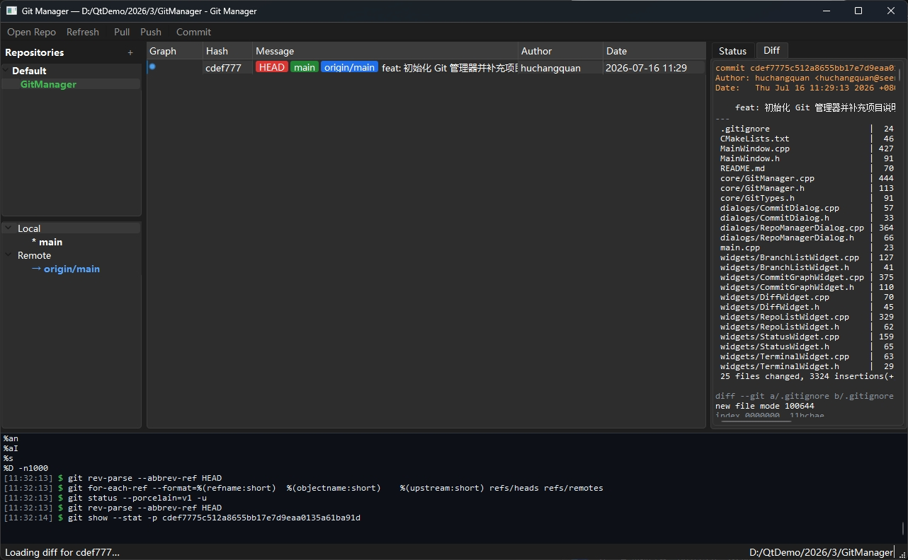

# Git Manager

Git Manager 是一个使用 Qt 6、C++17 和 libgit2 编写的桌面 Git 仓库管理工具。它直接读写 Git 仓库，在一个窗口中展示仓库、分支、提交历史、工作区状态和差异内容。

## 运行效果



## 主要功能

- 管理多个本地仓库，并支持按分组整理仓库列表
- 分页绘制提交历史与分支轨迹，支持搜索、作者/日期/分支/路径过滤和继续加载
- 查看本地、远程分支，支持切换、创建和删除分支
- 从提交或分支执行 Merge、普通 Rebase 和 Interactive Rebase
- 支持 Cherry-pick、Revert，以及 soft、mixed、hard 三种 Reset
- Interactive Rebase 支持 pick、reword、edit、squash、fixup 和 drop，并可在冲突或 edit 暂停后继续/终止
- 查看工作区及暂存区状态，支持暂存、取消暂存和批量操作
- 查看文件差异及指定提交的完整差异
- 创建提交，执行 Pull 和 Push
- 初始化、克隆仓库，Fetch 远程并发布新分支
- 管理 Stash，支持创建、应用、弹出和删除
- 按 Diff hunk 暂存、取消暂存或丢弃修改
- 识别冲突并选择当前/传入版本，继续或终止 Git 操作
- 复制提交 Hash、查看父子提交，并创建、删除标签
- 将未跟踪文件加入 `.gitignore`
- 在底部 Git 输出面板中查看操作和进度日志
- 管理 Worktree、Submodule、Git LFS 锁和主流托管平台评审入口
- 使用 Windows Credential Manager 保存托管平台 Token
- 查看 Git hooks、连接诊断，并使用受保护的 Force-with-lease 推送
- 配置外部 Diff/Merge 工具，自动保存窗口和面板布局

## 环境要求

- CMake 3.20 或更高版本
- 支持 C++17 的编译器
- Qt 6，包含 Core、Concurrent、Widgets 和 Test（仅测试）模块

本项目的 Windows 构建基线固定为 Qt 6.7.3 `msvc2019_64` + Visual Studio 2019，不要混用 Qt 的 `mingw_64` 套件；两套 Qt 库的 ABI 不兼容。项目外层使用 Ninja 生成器，编译器仍是 VS2019 的 MSVC。

项目将 `third_party/libgit2-1.9.4` 直接作为源码子项目构建，运行时不依赖 `git.exe`。Windows MSVC x64 默认直接导入仓库内预编译的 OpenSSL 3.0.16，不再执行 OpenSSL 源码构建，因此不需要 Perl、`nmake` 或其他 OpenSSL 构建工具。所需 DLL 和 Mozilla CA 根证书包会自动复制到可执行文件旁。macOS 默认使用 SecureTransport，Linux 默认使用 OpenSSL 动态加载后端。

SSH 远程当前使用 libgit2 的 OpenSSH exec 后端，因此需要系统可用的 `ssh`；HTTPS 操作不需要系统 Git。

### 当前开发环境

本项目当前已验证的 Windows 编译环境如下，便于后续快速恢复 Qt Creator Kit 或从命令行构建：

| 工具 | 版本或路径 |
| --- | --- |
| Qt | Qt 6.7.3（MSVC 2019 64-bit） |
| Qt 套件 | `D:/Qt/6.7.3/6.7.3/msvc2019_64` |
| CMake | `D:/Qt/6.7.3/Tools/CMake_64/bin/cmake.exe` |
| Ninja | `D:/Qt/6.7.3/Tools/Ninja/ninja.exe` |
| C++ 编译器 | MSVC 14.29.30133（Visual Studio 2019，x64） |
| `cl.exe` | `D:/vs/2019/IDE/VC/Tools/MSVC/14.29.30133/bin/HostX64/x64/cl.exe` |
| CMake 生成器 | Ninja |

### 已验证构建

| 配置 | 结果 |
| --- | --- |
| MSVC 2019 x64 + 预编译 OpenSSL 3.0.16 + 内置 libgit2 | 全新目录构建通过，CTest 12/12 通过；OpenSSL DLL 和 CA 包自动部署 |

本项目 Windows 主环境始终是 Qt 6.7.3 `msvc2019_64`。`Win_x64` 中的 OpenSSL DLL 和导入库由 VS2019/MSVC 14.29 以 `VC-WIN64A`、`/MD` 编译，与该 Qt 套件匹配。预编译包只有 Release 版本，Debug 版 Git Manager 也会使用同一组 OpenSSL DLL。

仓库还保存可选的 macOS ARM64 15.0+ 和 Ubuntu 22.04+ x86_64 预编译包，不支持 MinGW、Windows ARM64、macOS x86_64、Ubuntu 20.04 或 Linux ARM。当前 Windows 开发机无法代替 macOS/Linux 做实际运行验证。详细架构核验、最低系统要求、来源和 CA 哈希见 `third_party/OpenSSLv3.0.16/PREBUILT.md`。

Qt Creator 中对应的构建套件名称为 `Desktop Qt 6.7.3 MSVC2019 64bit`。如果工具或 SDK 被移动，需要同步修改 Kit 中的 Qt、CMake、编译器和调试器路径。

不要复用以前用于源码 OpenSSL 或 MinGW 审计的 `CMakeCache.txt`。应切换到 `build/Desktop_Qt_6_7_3_MSVC2019_64bit-Release`，或为 MSVC 新建构建目录；新配置不会再查找任何 OpenSSL 构建工具。

## 构建

在已配置 Qt 环境的终端中执行：

```bash
cmake -S . -B build
cmake --build build --config Release
```

预编译 OpenSSL 默认仅在 Windows MSVC 上启用。macOS/Linux 如需显式使用仓库内匹配平台的预编译包，可在配置命令末尾加入：

```bash
-DGITMANAGER_USE_PREBUILT_OPENSSL=ON
```

如果 CMake 无法自动找到 Qt，请指定 Qt 安装目录：

```bash
cmake -S . -B build -DCMAKE_PREFIX_PATH="D:/Qt/6.7.3/6.7.3/msvc2019_64"
cmake --build build --config Release
```

使用当前开发机的完整路径，可在已初始化 MSVC x64 环境的 PowerShell 中执行：

```powershell
& "D:/Qt/6.7.3/Tools/CMake_64/bin/cmake.exe" `
  -S . -B build/Release -G Ninja `
  -DCMAKE_BUILD_TYPE=Release `
  -DCMAKE_PREFIX_PATH="D:/Qt/6.7.3/6.7.3/msvc2019_64" `
  -DCMAKE_MAKE_PROGRAM="D:/Qt/6.7.3/Tools/Ninja/ninja.exe"

& "D:/Qt/6.7.3/Tools/CMake_64/bin/cmake.exe" --build build/Release
```

从普通终端构建前，应先把 Qt `bin` 和 Ninja 加入 `PATH`，再运行 `D:/vs/2019/IDE/VC/Auxiliary/Build/vcvars64.bat`，或直接使用 Qt Creator 的对应 Kit，以确保 Qt、MSVC 和 Windows SDK 环境变量同时可用。

构建完成后，运行生成的 `GitManager` 可执行文件。多配置生成器的 Release 程序通常位于 `build/Release/`，单配置生成器通常位于 `build/`。

### 安装与便携包

安装到指定目录：

```powershell
cmake --install build/Release --prefix build/install
```

Windows 便携目录需要额外部署 Qt 插件和运行库：

```powershell
cmake `
  -DAPP_EXECUTABLE="$PWD/build/Release/GitManager.exe" `
  -DDEPLOY_DIRECTORY="$PWD/build/deploy/GitManager" `
  -DWINDEPLOYQT_EXECUTABLE="D:/Qt/6.7.3/6.7.3/msvc2019_64/bin/windeployqt.exe" `
  -DOPENSSL_SSL_RUNTIME="$PWD/third_party/OpenSSLv3.0.16/Win_x64/bin/libssl-3-x64.dll" `
  -DOPENSSL_CRYPTO_RUNTIME="$PWD/third_party/OpenSSLv3.0.16/Win_x64/bin/libcrypto-3-x64.dll" `
  -DOPENSSL_CA_BUNDLE="$PWD/third_party/OpenSSLv3.0.16/certs/cacert.pem" `
  -P cmake/DeployQt.cmake
```

GitHub Actions 会在每次 Push 和 Pull Request 时执行 Windows Release 构建、12 项测试，并上传 `GitManager-Windows-x64` 便携包。

## 使用说明

1. 启动程序，点击工具栏的 **Open Repo**，选择一个已有 Git 仓库。
2. 从左侧仓库列表切换仓库，在分支列表中管理分支。
3. 在中间提交图中筛选或继续加载历史；选择提交可查看差异，右键可创建分支、Merge、Rebase、Cherry-pick、Revert、Reset、复制 Hash、查看父子提交或管理标签。
4. 在右侧 **Status** 页暂存或取消暂存文件，选择文件可在 **Diff** 页查看差异。
5. 暂存文件后点击 **Commit** 填写提交信息；使用工具栏执行 Pull 或 Push。

Pull 由 libgit2 执行 Fetch 后快进或 Rebase。工作区存在未提交修改时会拒绝不安全的覆盖；可先使用 Stash 保存修改，完成 Pull 后再恢复。快进更新当前分支时会先锁定引用，再 checkout，再原子提交引用更新，避免分支锁失败后留下“工作区已前进但 HEAD 未前进”的不一致状态。

Merge、Rebase、Cherry-pick 和 Revert 要求工作区、暂存区及未跟踪文件均为空。Reset 执行前会展示受影响提交，默认使用 mixed；hard Reset 和改写远程引用已可达的历史均需要单独确认。Reset 和 Rebase 的预览不仅绑定 HEAD 提交，也绑定当前分支身份，因此即使两个分支暂时指向同一提交，预览后切换分支也会拒绝继续执行。Interactive Rebase 使用固定拓扑顺序，发生冲突或停在 edit 时可通过工具栏的 **Continue/Abort** 恢复或终止。交互计划与当前 rebase 会话绑定，并使用写前状态和原子映射备份，因此关闭程序后再次打开仓库也可安全继续；检测到外部篡改或无法证明安全的中断状态时会拒绝继续，保留 Abort 入口。外部工具启动的多提交 Cherry-pick/Revert sequencer 当前会被识别为未知操作并安全拒绝 Continue/Abort，避免误接管并破坏外部状态。

## 测试

配置时启用测试并完成构建后，可以执行：

```powershell
& "D:/Qt/6.7.3/Tools/CMake_64/bin/ctest.exe" `
  --test-dir build/Release --output-on-failure -C Release
```

测试直接使用临时仓库和内置 libgit2。当前 12 个测试目标覆盖 Diff、状态与路径边界、提交历史分页、异步取消与仓库隔离、Stash、Worktree、Submodule、LFS、托管平台、凭据、诊断、hooks、Force-with-lease，以及 Merge、Rebase、Cherry-pick、Revert、Reset 和 Interactive Rebase。

`TestLibGit2Backend` 还包含一个默认跳过的真实 HTTPS 克隆测试。需要验证 OpenSSL DLL 和 CA 包时，可先设置公开仓库地址再运行该测试：

```powershell
$env:GITMANAGER_TEST_HTTPS_URL = "https://github.com/octocat/Hello-World.git"
& "build/Release/tests/TestLibGit2Backend.exe" bundledOpenSslHttpsClone
```

## 开发计划

后续架构调整、功能路线、逐文件任务和验收标准请参阅 [DEVELOPMENT_PLAN.md](DEVELOPMENT_PLAN.md)。实施完成后可直接在计划文件中勾选对应任务。

## 许可证

本项目使用 [MIT License](LICENSE)。

## 项目结构

```text
GitManager/
├── core/       # libgit2 后端、异步调度和数据类型
├── dialogs/    # 提交等对话框
├── widgets/    # 提交图、分支、状态、差异和终端组件
├── MainWindow.*
├── main.cpp
└── CMakeLists.txt
```

## 注意事项

- Git 操作通过异步队列执行；网络传输可通过工具栏的 **Cancel** 主动取消，仓库切换后旧任务结果不会写入新界面。
- Push、Pull 和远程分支操作依赖仓库自身已配置的远程地址。Remote 菜单支持会话级 HTTPS 凭据；GitHub、GitLab 和 Azure DevOps Token 可保存到 Windows Credential Manager。
- 删除分支、强制删除分支等操作会直接修改当前仓库，请确认后再执行。
- SSH URL 需要系统 OpenSSH；项目不依赖 `git.exe`。
